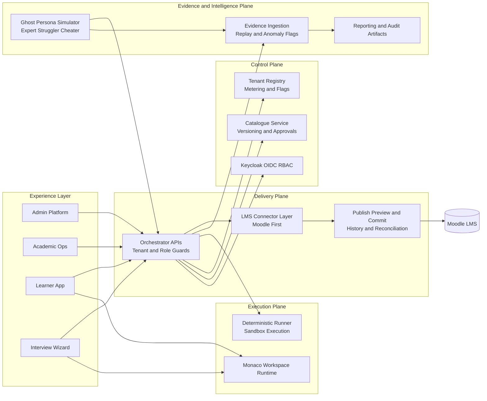

# Enterprise Requirements, Feature Map, and Phased Delivery Plan

## 1) Purpose

This document is the single tracking baseline for evolving the platform from an API-centric operator console into a catalogue-driven enterprise ecosystem.

It consolidates:

- Final requirements
- App-wise and system-wise feature definitions
- Enterprise architecture expectations
- Phased delivery milestones
- Gate-based done criteria
- Weekly tracking templates

## 2) Product Vision

Build a multi-tenant coding platform where:

1. The Catalogue is the source of truth for technologies, tracks, and activity templates.
2. LMS connectors are the delivery bridge for assignment provisioning, outcomes, and competency handover.
3. Coding execution is secure, observable, and deterministic.
4. Evidence and replay are first-class for pedagogy, screening, and auditability.
5. Every major feature is validated with Ghost User persona runs against real APIs.

## 3) Scope Model

### 3.1 In Scope (Enterprise Baseline)

- Catalogue-driven course/activity lifecycle
- Tenant-aware IAM and RBAC with Keycloak
- Moodle connector as reference LMS adapter
- Evidence ingestion and replay
- Learner handover guard with competency payload validation
- Ghost persona simulation (expert, struggler, cheater)
- Metering and governance controls

### 3.2 Out of Scope (Current Program Cycle)

- Full multi-LMS parity in first wave (beyond Moodle)
- Physical tenant isolation for all tiers (kept for premium tiers later)
- Proctoring hardware integrations

## 4) App-Wise Requirements (4-App Model)

## 4.0 Block Diagrams

### 4.0.1 Features Per App (Block View)

```mermaid
flowchart TB
  Admin[Admin Platform\nGovernance]
  A1[Tenant Provisioning\nList and Create]
  A2[RBAC and Role Assignment\nTenant Users]
  A3[Metering and Feature Flags]
  A4[Super Admin Impersonation]

  Ops[Academic Ops\nContent and Quality]
  O1[Catalogue Manager\nTech Stacks and Templates]
  O2[Context Bridge\nURL or README to Draft]
  O3[Review and Approval Workflow]
  O4[Evidence Player\nReplay and Flags]
  O5[Ghost Run Trigger\nExpert Struggler Cheater]

  Learner[Learner App\nGrowth and Practice]
  L1[Monaco Workspace\nRun and Evaluate]
  L2[Learning Module Generation]
  L3[Assessment Feedback\nDeterministic and LLM]
  L4[Handover Guard\nCompetency Payload Check]
  L5[Guided Simulation Console]

  Wizard[Interview Wizard\nHigh Stakes Screening]
  W1[Hardened Runtime Controls]
  W2[Binary Plus Scoring\n70 Functional 30 Insight]
  W3[Interviewer Cockpit\nLive Annotations]

  Admin --> A1
  Admin --> A2
  Admin --> A3
  Admin --> A4

  Ops --> O1
  Ops --> O2
  Ops --> O3
  Ops --> O4
  Ops --> O5

  Learner --> L1
  Learner --> L2
  Learner --> L3
  Learner --> L4
  Learner --> L5

  Wizard --> W1
  Wizard --> W2
  Wizard --> W3
```

### 4.0.2 Overall System Support (Block View)

## App 1: Admin Platform (Governance)

### Required features

- Tenant provisioning and listing
- Role assignment per tenant user
- Tenant user listing
- Tenant metering dashboards
- Super admin impersonation
- Feature flag controls per tenant
- Health and connector status summary

### Enterprise acceptance

- Super admin can view all tenants
- Tenant admin can view only assigned tenants
- Cross-tenant access blocked for non-super admin
- Full audit trail for tenant and role changes

### Tenant Admin Module: Detailed Feature Backlog and Phase Tracker

This section is the implementation tracker for tenant-admin-specific capabilities.

#### Module A: Tenant Workspace and Access Scope

- Tenant-scoped dashboard and default workspace
- Tenant profile view and editable metadata
- Tenant feature visibility by role
- Connector health summary per tenant

#### Module B: Tenant Users and Role Operations

- Create and manage tenant users
- Assign and update tenant roles
- Tenant user-role matrix view
- Bulk role import/export for onboarding
- Role-change audit timeline

#### Module C: Tenant Governance Controls

- Tenant feature flags
- Tenant policy controls (approval strictness, evidence policies)
- Metering and quota controls
- Tenant-level operational alerts

#### Module D: Connector and Delivery Governance

- Connector configuration status and validation
- Publish dry-run governance
- Publish commit authorization controls
- Publish history and reconciliation view

#### Module E: Audit, Compliance, and Security

- Tenant action audit log
- Security posture summary (tenant scoped)
- Evidence retention policy controls
- Compliance export package generation

#### Module F: Operations and Support

- Tenant health board
- Incident and recovery timeline
- Safe retry/replay controls for failed tenant jobs
- Support handoff artifact generation

### Current Build Status (Baseline)

| Capability | Current Status | Notes |
|---|---|---|
| Tenant list (scoped/global by role) | Implemented | Available via admin routes and current Admin app actions |
| Tenant create | Implemented | Super admin path implemented |
| Tenant user role assignment | Implemented | Upsert API and Admin app action available |
| Tenant user listing | Implemented | Tenant-scoped listing in place |
| Tenant metering view | Implemented | API + Admin app action available |
| Super admin impersonation helper | Implemented | API response exists, UI action available |
| Feature flag management UI/API | Planned | Not yet implemented |
| Tenant policy management | Planned | Not yet implemented |
| Publish governance console | Planned | Not yet implemented in Admin app |
| Tenant audit timeline UI | Planned | Backlog item |
| Bulk user-role operations | Planned | Backlog item |
| Compliance export controls | Planned | Backlog item |

### Phase-Wise Delivery for Tenant Admin Module

#### Phase 0 (Weeks 1-3): Access and Isolation Hardening

- Finalize tenant-scoped dashboard behavior
- Harden tenant guardrails for all admin operations
- Expand RBAC tests for tenant-admin and cross-tenant denial

Exit:

- Gate 1 and Gate 3 complete for tenant-admin core routes

#### Phase 1 (Weeks 4-8): Governance Foundations

- Build feature flag management UI/API
- Add tenant policy controls (basic set)
- Add audit timeline API and initial UI

Exit:

- Gate 1 and Gate 2 complete for governance controls

#### Phase 2 (Weeks 9-13): Delivery Governance and Operations

- Build publish governance console (dry-run + commit visibility)
- Add connector validation and reconciliation summary
- Add operational alerting and incident timeline view

Exit:

- Gate 1-3 complete for delivery governance flows

#### Phase 3 (Weeks 14-18): Compliance and Scale Readiness

- Compliance export package controls
- Evidence retention and policy administration UI
- Bulk onboarding and user-role automation features

Exit:

- Gate 1-4 complete, including ghost proof for tenant-admin-critical workflows

### Tenant Admin Gate Tracker

| Feature Group | Gate 1 API | Gate 2 UI | Gate 3 Security | Gate 4 Ghost Proof | Owner | Status |
|---|---|---|---|---|---|---|
| Tenant workspace and scope | Yes | Yes | Yes | No | TBC | In Progress |
| Users and role operations | Yes | Yes | Yes | No | TBC | In Progress |
| Governance controls | No | No | No | No | TBC | Not Started |
| Connector and delivery governance | No | No | No | No | TBC | Not Started |
| Audit and compliance controls | No | No | No | No | TBC | Not Started |
| Ops and support controls | No | No | No | No | TBC | Not Started |

## App 2: Academic Ops (Content and Quality)

### Required features

- Catalogue Manager:
  - Create technology stacks and templates
  - Version and approval workflow
- Context Bridge:
  - URL/README ingestion
  - Draft generation and review transitions
- Evidence Player:
  - Timeline replay with anomaly flags
- Ghost Run Trigger:
  - Execute persona scenarios and compare outcomes

### Enterprise acceptance

- Draft state transitions are enforced and auditable
- Replay output includes deterministic event order and flags
- Persona runs are reproducible with seed controls

### Academic Ops Module: Detailed Feature Backlog and Phase Tracker

This section tracks delivery of catalogue and quality workflows under Academic Ops.

#### Module A: Catalogue Manager

- Technology stack library management
- Activity template authoring and versioning
- Track/course blueprint composition
- Catalogue publishability validation

#### Module B: Review and Approval Governance

- Draft lifecycle management (draft, in_review, approved)
- Reviewer assignment and decision logs
- Approval history with rollback controls

#### Module C: Context Bridge

- URL/README ingestion pipeline
- Zero-shot draft generation
- Level/objective tuning controls

#### Module D: Evidence Player

- Session timeline replay UI
- Deterministic event ordering and filters
- Anomaly markers and evidence statistics

#### Module E: Ghost Validation Console

- Persona run trigger and run history
- Persona outcome comparison view
- Gate-ready proof artifact export

### Current Build Status (Baseline)

| Capability | Current Status | Notes |
|---|---|---|
| Context bridge generate API | Implemented | Authoring generate path available |
| Draft retrieval and transitions | Implemented | Get, submit-review, approve endpoints exist |
| Evidence session ingest | Implemented | Event ingest API in place |
| Evidence replay | Implemented | Replay endpoint with flags and stats available |
| Ghost persona run | Implemented | Persona run endpoint available |
| Catalogue manager domain and UI | Planned | Not yet implemented as full catalogue module |
| Reviewer assignment workflow | Planned | Backlog item |
| Approval rollback controls | Planned | Backlog item |
| Ghost run proof export UI | Planned | Backlog item |

### Phase-Wise Delivery for Academic Ops Module

#### Phase 0 (Weeks 1-3): Authoring and Evidence Stability

- Harden existing context bridge and evidence APIs
- Expand role and tenant guard coverage in tests
- Stabilize replay semantics and error contracts

Exit:

- Gate 1 and Gate 3 complete for existing Academic Ops APIs

#### Phase 1 (Weeks 4-8): Catalogue Core

- Build catalogue entities and APIs
- Add Catalogue Manager UI surfaces
- Add versioning and catalogue validation rules

Exit:

- Gate 1 and Gate 2 complete for catalogue create/edit/list/version workflows

#### Phase 2 (Weeks 9-13): Review and Approval Governance

- Reviewer assignment and approval decision trails
- Approval rollback and publish readiness checks
- Evidence-linked approval views

Exit:

- Gate 1-3 complete for review and approval governance

#### Phase 3 (Weeks 14-18): Ghost-Proof and Quality Maturity

- Ghost proof artifact generation and export
- Persona delta comparison dashboard
- Gate-ready quality evidence package

Exit:

- Gate 1-4 complete for catalogue-to-approval-to-ghost loop

### Academic Ops Gate Tracker

| Feature Group | Gate 1 API | Gate 2 UI | Gate 3 Security | Gate 4 Ghost Proof | Owner | Status |
|---|---|---|---|---|---|---|
| Context bridge and draft transitions | Yes | Partial | Yes | No | TBC | In Progress |
| Evidence replay | Yes | Partial | Yes | No | TBC | In Progress |
| Ghost persona run controls | Yes | Partial | Yes | No | TBC | In Progress |
| Catalogue manager | No | No | No | No | TBC | Not Started |
| Review and approval governance | Partial | No | Partial | No | TBC | Not Started |

## App 3: Learner App (Growth and Practice)

### Required features

- Monaco workspace and run/evaluate loop
- Learning module generation
- Deterministic and LLM feedback modes
- Handover Guard pre-return validation
- Guided simulation console access for controlled demos

### Enterprise acceptance

- Learner cannot access authoring/admin routes
- Handover fails safely on invalid competency payload
- Response latency and reliability meet SLOs

### Learner and Handover Module: Detailed Feature Backlog and Phase Tracker

This section tracks learner journey, assessment quality, and LMS handover readiness.

#### Module A: Learner Workspace and Assessment Loop

- Monaco workspace with run/evaluate flow
- Learning module generation controls
- Deterministic and LLM feedback modes
- Learner activity timeline capture hooks

#### Module B: Handover Guard

- Competency payload validator
- Evidence-session reference checks
- Handover readiness states and error reasons
- Return-to-LMS payload confirmation flow

#### Module C: Learner Experience Reliability

- Role-based route guard behavior
- Token and tenant context handling
- Action console and clear error states
- Latency-aware UX feedback

#### Module D: Simulation-Assisted Demo Path

- Guided Simulator Test Console integration
- Tenant-aware scenario and connector actions
- Demo-safe cleanup and reset actions

### Current Build Status (Baseline)

| Capability | Current Status | Notes |
|---|---|---|
| Learning module generation | Implemented | Learner path available |
| Assessment evaluation flow | Implemented | Deterministic/LLM orchestration path available |
| Handover guard API | Implemented | Delivery handover endpoint implemented |
| Handover action in learner UI | Implemented | Return to LMS action available |
| Guided simulator console in learner app | Implemented | Simulation tab with lifecycle actions available |
| Fine-grained learner route guard UX | Planned | Backlog for strict app-level routing |
| Learner evidence timeline hooks | Planned | Backlog item |
| Handover approval and signoff UX | Planned | Backlog item |

### Phase-Wise Delivery for Learner and Handover Module

#### Phase 0 (Weeks 1-3): Learner Path Stabilization

- Harden assessment and learning APIs for tenant and role behavior
- Improve runtime error messaging in learner UI
- Add regression tests around handover guard failures

Exit:

- Gate 1 and Gate 3 complete for learner and handover APIs

#### Phase 1 (Weeks 4-8): Handover Contract Maturity

- Expand competency payload contract checks
- Add richer handover readiness states in UI
- Add clear evidence-link requirements for high-stakes handovers

Exit:

- Gate 1 and Gate 2 complete for handover workflows

#### Phase 2 (Weeks 9-13): Learner UX and Reliability Enhancements

- Add role-based route guard UX refinements
- Add latency and retry-friendly UI states
- Strengthen simulator-assisted learner demo journey

Exit:

- Gate 1-3 complete for learner experience reliability

#### Phase 3 (Weeks 14-18): Evidence-Driven Completion Validation

- Link learner completion signals to evidence quality thresholds
- Add ghost-backed proof checks for selected learner journeys
- Export learner handover proof artifacts

Exit:

- Gate 1-4 complete for learner-to-handover end-to-end path

### Learner and Handover Gate Tracker

| Feature Group | Gate 1 API | Gate 2 UI | Gate 3 Security | Gate 4 Ghost Proof | Owner | Status |
|---|---|---|---|---|---|---|
| Learning and assessment loop | Yes | Yes | Yes | No | TBC | In Progress |
| Handover guard core | Yes | Yes | Yes | No | TBC | In Progress |
| Learner route and context reliability | Partial | Partial | Partial | No | TBC | Not Started |
| Evidence-driven completion validation | No | No | No | No | TBC | Not Started |
| Simulation-assisted learner demo path | Yes | Yes | Yes | No | TBC | In Progress |

## App 4: Interview Wizard (Screening)

### Required features

- Hardened environment controls (copy/paste and tab behavior policies)
- Binary-plus scoring:
  - 70% functional metrics
  - 30% logical insight metrics
- Interviewer cockpit with live observation annotations

### Enterprise acceptance

- Security controls are testable and enforced in high-stakes mode
- Scoring components and evidence traces are explainable

## 5) System-Wise Requirements

## 5.1 Control Plane

- Catalogue service with versioned entities
- Tenant registry and policy engine
- Feature flag service
- Metering and quota service

## 5.2 Delivery Plane

- LMS connector orchestration layer
- Publish preview (dry run) and commit flows
- Idempotent connector operations
- Publish history and reconciliation support

## 5.3 Execution Plane

- Sandbox-aware runner integration
- Deterministic test execution reports
- Runtime telemetry and error traceability

## 5.4 Evidence and Intelligence Plane

- Event ingestion APIs
- Replay and anomaly analysis engine
- Persona simulation integration
- Reporting surfaces for MIS/compliance

## 6) Security and Compliance Baseline

- OIDC token validation and refresh handling
- Tenant claim enforcement on all tenant-scoped routes
- Role guard enforcement on every protected endpoint
- Immutable audit events for governance actions
- Data retention classes for evidence and security logs
- Secrets managed outside source code

## 7) API Contract Baseline

Each enterprise API must satisfy:

1. Pydantic typed request/response models
2. Explicit tenant scope handling
3. Role guard declaration
4. Structured error contracts
5. Traceable request IDs
6. Contract tests in CI

## 8) Frontend Workflow Baseline

Each frontend app must satisfy:

1. OIDC-aware session handling
2. Role-based route guards
3. Token/tenant context propagation
4. Deterministic loading/error/empty states
5. Audit-safe action confirmations for high-impact operations

## 9) Ghost User Validation Baseline

Ghost validation is mandatory for feature signoff.

For each major feature:

1. Run expert persona
2. Run struggler persona
3. Run cheater persona
4. Compare evidence flags and expected outcomes
5. Store artifacts for release evidence

No critical feature is considered done if persona validation is missing.

## 10) 4-Gate Done Framework

## Gate 1: API and Contract

- Endpoint contract documented
- Type-safe schema validated
- Tenant and role enforcement tested

## Gate 2: Frontend Workflow

- UI flow complete for target roles
- Route guard and token flow verified
- Error handling verified

## Gate 3: RBAC and Security

- Keycloak mapping verified
- Cross-tenant access tests passing
- Security checklist items completed

## Gate 4: Ghost Validation

- Persona runs executed against real APIs
- Evidence and MIS outputs validated
- Artifacts attached to release notes

## 11) Phased Delivery Plan

## Phase 0: Foundation Hardening (Weeks 1-3)

### Goals

- Stabilize auth, tenant isolation, and observability baseline

### Deliverables

- Unified auth context handling in backend and frontend
- Tenant/RBAC test coverage expansion
- Request tracing and structured logs in core paths

### Exit criteria

- Gate 1 and Gate 3 passing for core admin/auth/connectors routes

## Phase 1: Catalogue and Governance Core (Weeks 4-8)

### Goals

- Introduce catalogue-first workflows with governance controls

### Deliverables

- Catalogue domain models and APIs
- Catalogue manager UI in Academic Ops
- Approval/versioning workflow
- Publish preview and commit controls

### Exit criteria

- Gate 1 and Gate 2 for catalogue workflows
- Initial Gate 4 for one catalogue-to-publish path

## Phase 2: Learner and Evidence Maturity (Weeks 9-13)

### Goals

- Improve learner quality loop and evidence intelligence

### Deliverables

- Enhanced handover guard and competency contract checks
- Evidence replay enhancements and anomaly explainability
- Learner UX reliability improvements

### Exit criteria

- All learner and evidence workflows pass Gates 1-4

## Phase 3: Interview Wizard and Enterprise Controls (Weeks 14-18)

### Goals

- Harden high-stakes screening and enterprise governance

### Deliverables

- Interview mode hardening controls
- Interviewer cockpit
- Binary-plus scoring engine
- Compliance and audit package generation

### Exit criteria

- Interview journey passes all four gates
- Security and compliance signoff completed

## Phase 4: Scale and Partner Readiness (Weeks 19-24)

### Goals

- Operational readiness for multi-tenant scale and partner onboarding

### Deliverables

- Reconciliation jobs and drift detection
- Connector certification pack templates
- Capacity and cost optimization improvements

### Exit criteria

- Pilot readiness signoff
- SLO adherence in staged load tests

## 12) Tracking Model (Weekly)

## 12.1 Epic Tracker

| Epic | Phase | Owner | Status | Gate 1 | Gate 2 | Gate 3 | Gate 4 | Notes |
|---|---|---|---|---|---|---|---|---|
| Auth and Tenant Isolation | 0 | TBC | Not Started | No | No | No | No | |
| Catalogue Manager | 1 | TBC | Not Started | No | No | No | No | |
| Publish Preview/Commit | 1 | TBC | Not Started | No | No | No | No | |
| Learner Handover Guard | 2 | TBC | In Progress | Yes | Yes | Yes | No | Persona validation pending |
| Evidence Replay and Flags | 2 | TBC | In Progress | Yes | Yes | Yes | No | |
| Interview Wizard | 3 | TBC | Not Started | No | No | No | No | |
| Scale and Certification | 4 | TBC | Not Started | No | No | No | No | |

## 12.2 Weekly Status Template

- Week:
- Phase:
- Completed this week:
- Planned next week:
- Gate status changes:
- Risks and blockers:
- Decisions needed:
- Demo artifacts produced:

## 12.3 KPI Tracker

| KPI | Target | Current | Trend | Owner |
|---|---|---|---|---|
| p50 API latency (critical routes) | <= 250 ms | TBC | TBC | TBC |
| p95 API latency (critical routes) | <= 800 ms | TBC | TBC | TBC |
| Ghost run pass rate | >= 95% | TBC | TBC | TBC |
| Cross-tenant violation incidents | 0 | TBC | TBC | TBC |
| Gate closure predictability | >= 90% on-time | TBC | TBC | TBC |

## 13) Immediate Next Actions

1. Freeze this document as the program baseline.
2. Assign owners for each epic in section 12.1.
3. Convert current backlog into gate-mapped work items.
4. Begin weekly status updates using section 12.2.
5. Attach ghost run artifacts for all in-progress epics.

## 14) Change Control

Any requirement change must include:

1. Business rationale
2. Phase impact
3. Gate impact
4. Test impact
5. Rollback/mitigation plan
