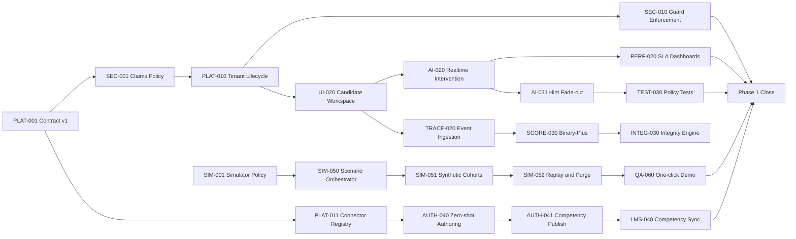

# Critical Path Dependency Map

## 1) Objective

Identify sequence-critical work that directly affects Phase 1 go-live.

## 2) Critical Path (CP)

CP-1 Contract Freeze:
- PLAT-001 -> SEC-001 -> SCORE-001

CP-2 Tenancy Foundation:
- SEC-001 -> PLAT-010 -> SEC-010

CP-3 Connector Activation:
- PLAT-001 -> PLAT-011 -> LMS-040

CP-4 Workspace and SLA:
- PLAT-010 -> UI-020 -> AI-020 -> PERF-020

CP-5 Scoring and Integrity:
- TRACE-020 -> SCORE-030 -> INTEG-030

CP-6 Hint Policy:
- AI-020 -> AI-031 -> TEST-030

CP-7 Authoring to Outcome Closure:
- PLAT-011 -> AUTH-040 -> AUTH-041 -> LMS-040

CP-8 Demo Readiness:
- SIM-001 -> SIM-050 -> SIM-051 -> SIM-052 -> QA-060

## 3) Dependency Risks

- Delay in SEC-001 blocks all guarded implementation.
- Delay in AI-020 blocks latency gate validation.
- Delay in LMS-040 blocks competency closure and pilot readiness.
- Delay in SIM-050 blocks reproducible demos and analytics proof.

## 4) Mitigation Actions

- Assign backup owner for each CP anchor ticket.
- Start test scaffolding one sprint earlier for CP-4/CP-6.
- Reserve hardening buffer at end of every milestone.
- Run twice-weekly dependency unblock session.

## 5) Visual (Mermaid)

## 6) Phase 1 Close Conditions (Critical Path Complete)

- G1 latency gate passing
- G2 hint policy gate passing
- G3 claim guard gate passing
- LMS competency closure verified
- One-click simulator demo validated
